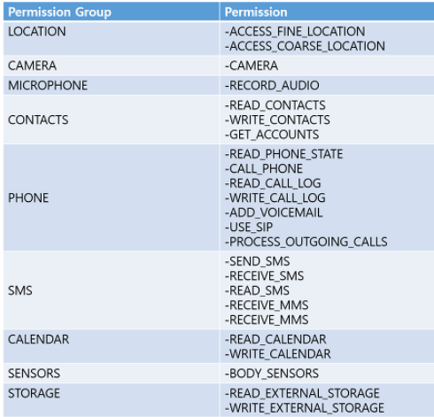

# Android information

## [Fragment](https://github.com/hyunho058/AndroidTIL/blob/master/Fragment.md)

### Data Share

* Activity -> Fragment Data send
  * Bundle을 이용해 Data 전달 한다
    * String, int 등 기본 Type과 Object, ArrayList 를 넘길 수 있다.
    * putSerializable("Key", Value)
      * Key를 이용하여 Fragment에서 Data를 받는다.
* MainActivity

```java
fragmentTransaction=fragmentManager.beginTransaction();
bundle = new Bundle();
fragmentHome = new FragmentHome();
bundle.putSerializable("list", list);
fragmentTransaction.replace(
    R.id.frame, fragmentHome).commitAllowingStateLoss();
fragmentHome.setArguments(bundle);
```

* Fragment

```java
list=(ArrayList<SystemInfoVO>)getArguments().get("list");
```

### Err

*  java.lang.RuntimeException: Parcel: unable to marshal value model.SystemInfoVO

  * Bundle을 통해 데이터를 전달하는 과정에서 에러 발생
  * SystemInfoVO Class에서 직렬화를 해주지 않아 발생
    * implements Serializable 를 추가하여 문제 처리

  ```java
  public class SystemInfoVO implements Serializable 
  ```

  


### Reference

[Fragment Data Send](https://iw90.tistory.com/131)


## View Pager&Tab Layout

### TabLayout

```java
tabLayout=(TabLayout)findViewById(R.id.tabLayout);

//TabLayout 항목 추가
tabLayout.addTab(tabLayout.newTab().setCustomView(createTabView(
    "HOME",R.drawable.house_black_18dp)));
tabLayout.addTab(tabLayout.newTab().setCustomView(createTabView(
    "Win",R.drawable.toys_black_18dp)));
tabLayout.addTab(tabLayout.newTab().setCustomView(createTabView(
    "냉장고",R.drawable.kitchen_black_18dp)));
tabLayout.addTab(tabLayout.newTab().setCustomView(createTabView(
    "현관문",R.drawable.border_vertical_black_18dp)));
tabLayout.addTab(tabLayout.newTab().setCustomView(createTabView(
    "조명",R.drawable.incandescent_black_18dp)));
/**
* TabLayout 터치 이벤트
*/
tabLayout.addOnTabSelectedListener(new TabLayout.OnTabSelectedListener() {
    @Override
    public void onTabSelected(TabLayout.Tab tab) {
        Log.v(TAG,"onTabSelected()_getPosition=="+tab.getPosition());
        fragmentTransaction=fragmentManager.beginTransaction();
        bundle = new Bundle();
        switch (tab.getPosition()){
            case 0:
                break;
            case 1:
                break;
            case 2:
                break;
            case 3:
                break;
            case 4:

        }
    }
    @Override
    public void onTabUnselected(TabLayout.Tab tab) {

    }
    @Override
    public void onTabReselected(TabLayout.Tab tab) {

    }
});
//customTabViewCreate//
private View createTabView(String tabName, int iconImage){
    View tabView = getLayoutInflater().inflate(R.layout.custom_tab, null);
    TextView tvTab = (TextView) tabView.findViewById(R.id.tvTab);
    tvTab.setText(tabName);
    ImageView ivTab = (ImageView) tabView.findViewById(R.id.ivTab);
    ivTab.setImageResource(iconImage);
    return tabView;
}
```

* Method
  * onTabSelected()
    * 텝이 선택 되었을때 호출
  * onTabUnselected()
    * 텝이 선택되지 않았을 때 호출
  * onTabReselected()
    * 텝이 다시 선택되었을 때 호출

### View Page

* 원하는 page 개수만큼 Fragment 생성
* View Pager를 관리하는 Page Adapter Create
* Page Adapter내에 있는 fragments 배열에 만든 Fragment를 넣어준다
* View에 Page Adapter를 장착
* Tab Layout에 View Pager를 연동
* Tab Layout에 Custom View를 통해 원하는 모양으로 View를 적용

```java
FragmentReceiver fReceiver = FragmentReceiver.shareMyString(mystring);
adapter.addFragment(fReceiver);

public static FragmentReceiver shareMyString(String value) {
    FragmentReceiver f = new FragmentReceiver();
    Bundle args = new Bundle();
    args.putString("mystring", value);
    f.setArguments(args);
    return f;
}
 
@Override
public void onViewCreated(@NonNull View view, @Nullable Bundle savedInstanceState) {
    super.onViewCreated(view, savedInstanceState);
    myString = getArguments().getString("mystring");
}

ViewPagerActivity에서는 어댑터에 add하기 전에, 미리 프래그먼트를 선언하고, 메소드로 데이터를 전달합니다.
전달 받을 프래그먼트에서는 위와 같이 ShareMyString이라는 메소드를 하나 만들고, onViewCreated에서 부여한 key값을 통해 데이터를 받을 수 있습니다.
```

### Reference

[Viewpater&TabLayout](https://kangmin1012.tistory.com/12)

[ViewPager](https://hyogeun-android.tistory.com/entry/%EC%95%88%EB%93%9C%EB%A1%9C%EC%9D%B4%EB%93%9C-%EA%B0%95%EC%9D%98-9-TabLayout-ViewPager-%EC%99%80-BaseActivity%EC%82%AC%EC%9A%A9)


## [RecyclerView](https://github.com/hyunho058/AndroidTIL/blob/master/RecyclerVIew.md)

### Item Select Event

```java
///RecyclerView Item Background Change///
if (selectedPosition == position && selectedPosition != 0)
    holder.itemView.setBackgroundResource(R.drawable.round_border_select);
else
    holder.itemView.setBackgroundResource(R.drawable.round_border);

/**
         * //RecyclerView Touch Event (ItemVIew Click시 해당 Item에 Logic처리 가능)//
         */
holder.itemView.setOnClickListener(new View.OnClickListener() {
    @Override
    public void onClick(View v) {
        Log.v(TAG,"onBindViewHolder()_onClick()_position=="+position);
        switch (position){
            case  0:
                break;
            case 1:
                sharedObject.put("/ANDROID>/MODE SMART");
                oldPosition = selectedPosition;
                selectedPosition = position;

                notifyItemChanged(oldPosition);
                notifyItemChanged(selectedPosition);
                break;
            case 2:
                oldPosition = selectedPosition;
                selectedPosition = position;

                notifyItemChanged(oldPosition);
                notifyItemChanged(selectedPosition);
                break;
            case 3:
                oldPosition = selectedPosition;
                selectedPosition = position;

                notifyItemChanged(oldPosition);
                notifyItemChanged(selectedPosition);
                break;
        }
    }
});
```

### Reference

[ItemClickChangeEvent](https://marlboroyw.tistory.com/522)


## QR code

* Zxing Library
* build.gradle

```
compile 'com.journeyapps:zxing-android-embedded:3.2.0@aar'
compile 'com.google.zxing:core:3.2.1'
implementation 'com.journeyapps:zxing-android-embedded:3.6.0'
```

### Zxing in Fragment 

```java
@Nullable
@Override
public View onCreateView(@NonNull LayoutInflater inflater, @Nullable ViewGroup container, @Nullable Bundle savedInstanceState) {
    view = inflater.inflate(R.layout.fragment_fridge,container,false);
    context=container.getContext();
    //QR code Scanner Start
    IntentIntegrator.forSupportFragment(FragmentFridge.this).initiateScan();

    return  view;
}
/**
* QR code - Zxing Library
*/
@Override
public void onActivityResult(int requestCode, int resultCode, @Nullable Intent data) {
    Log.v(TAG,"onActivityResult"+resultCode);
    if(resultCode == Activity.RESULT_OK) {
        IntentResult scanResult = IntentIntegrator.parseActivityResult(requestCode, resultCode, data);
        Log.v(TAG, "result.getContents() == "+scanResult.getContents());
        Toast.makeText(context,scanResult.getContents(),Toast.LENGTH_SHORT).show();
    } else {
        super.onActivityResult(requestCode, resultCode, data);
    }
}
```


### Reference

[CustomZxing](https://dpdpwl.tistory.com/20)

[in Fragment](https://stackoverflow.com/questions/37251583/how-to-start-zxing-on-a-fragment/43966669)

## Socket Communication

* Socket
  * PrintWriter
  * BufferedReader

### PrintWriter

* MainActivity

```java
Thread thread = new Thread(new Runnable() {
    @Override
    public void run() {
        try {
            socket=new Socket("IP",1234);
            bufferedReader = new BufferedReader(
                new InputStreamReader(socket.getInputStream()));
            printWriter = new PrintWriter(socket.getOutputStream());
            Log.v(TAG,"Socket Situation=="+socket.isConnected());
            asyncTask.execute();
            while (true){
                String msg = sharedObject.pop();
                printWriter.println(msg);
                printWriter.flush();
            }
        }catch (IOException e){
            Log.v(TAG,"Socket Communication IOException=="+ e);
        }
    }
});
thread.start();
```

* ShraredObject

```java
/**
 * Queue 구조로 LinkedList에 put Method로 데이터를 입력하고 pop Method로 데이터를 꺼낸다.
 */
public class SharedObject {
    String TAG = "SharedObject";
    Object monitor = new Object();
    private LinkedList<String> dataList = new LinkedList<>();

    public void put(String msg) {
        synchronized (monitor){
            Log.v(TAG, "put() == " + msg);
            dataList.addLast(msg);
            monitor.notify();
        }
    }

    public String pop() {
        String result = "";
        synchronized (monitor) {
            if (dataList.isEmpty()) {
                try{
                    monitor.wait();
                    result = dataList.removeFirst();

                }catch (InterruptedException e){
                    Log.v(TAG,"pop()_InterruptedException=="+e);
                }
            }else {
                Log.v(TAG,"pop() =="+dataList.getFirst());
                result = dataList.removeFirst();
            }
        }
        return result;
    }
}
```

### BufferedReader

* Fragment

```java
public class FragmentTest extends Fragment {
    String TAG="FragmentTest";
    View view;
    Context context;
    SeekBar sbLED;
    TextView tvReceiveData;
    Button btnTest;
    Communication.SharedObject sharedObject;
    BufferedReader bufferedReader;

    public FragmentTest(Communication.SharedObject sharedObject, BufferedReader bufferedReader){
        this.sharedObject=sharedObject;
        this.bufferedReader=bufferedReader;
    }
    @Nullable
    @Override
    public View onCreateView(@NonNull LayoutInflater inflater, @Nullable ViewGroup container, @Nullable Bundle savedInstanceState) {
        view = inflater.inflate(R.layout.fragment_test,container,false);
        context=container.getContext();
        tvReceiveData=view.findViewById(R.id.tvReceiveData);

        btnTest=view.findViewById(R.id.btnTest);
        btnTest.setOnClickListener(new View.OnClickListener(){
            @Override
            public void onClick(View v) {
                Log.v(TAG,"onClick");
                tvReceiveData.setText("바뀌니???");
            }
        });
        /**
         * asyncTaskTest Object 인자에 bufferedReader 와 TextVIew를 넘겨준다
         */
        Communication.DataReceiveAsyncTaskTest asyncTaskTest =
                new Communication.DataReceiveAsyncTaskTest(bufferedReader, tvReceiveData);
        asyncTaskTest.execute();
        /**
         * SeekBar를 이용해 0-255 까지의 Int값을 받아 sharedObject에 Data를 넘겨준다
         */
        sbLED=view.findViewById(R.id.sbLED);
        sbLED.setOnSeekBarChangeListener(new SeekBar.OnSeekBarChangeListener() {
            @Override
            public void onProgressChanged(SeekBar seekBar, int progress, boolean fromUser) {
                Log.v(TAG,"onProgressChanged =="+progress);
                sharedObject.put(String.valueOf(progress));
            }
            @Override
            public void onStartTrackingTouch(SeekBar seekBar) {

            }
            @Override
            public void onStopTrackingTouch(SeekBar seekBar) {

            }
        });
        return  view;
    }
}
```

* AsyncTask

```java
public class DataReceiveAsyncTaskTest extends AsyncTask<Void, String, String> {
    String TAG="DataReceiveAsyncTaskTest";
    BufferedReader bufferedReader;
    TextView tvReceiveData;

    String msg = "";

    public DataReceiveAsyncTaskTest(BufferedReader bufferedReader, TextView tvReceiveData){
        this.bufferedReader=bufferedReader;
        this.tvReceiveData=tvReceiveData;
    }
    /**\
     *Thread 처리 Code
     */
    @Override
    protected String doInBackground(Void... voids) {
        while (true){
            try {
                msg = bufferedReader.readLine();
                Log.v(TAG,"doInBackground()_readLine()=="+msg);
                publishProgress(msg);
            }catch (IOException e){
                Log.v(TAG,"doInBackground()_IOException=="+e);
            }
        }
    }
    /**
     * Thread가 진행 중 실행 UI를 변경할 수 있다.
     * Thread 진행중 bufferedReader를 통해 받아온 데이터를 TextView에 Set해준다
     */
    @Override
    protected void onProgressUpdate(String... values) {
        super.onProgressUpdate(values);
        Log.v(TAG,"nProgressUpdate_values="+values[0]);
        tvReceiveData.setText(values[0]);
        Log.v(TAG,"getText()=="+tvReceiveData.getText());
    }
    /**
     * doInBackground 의 수행이 끝난뒤 실행
     */
    @Override
    protected void onPostExecute(String s) {
        super.onPostExecute(s);
        Log.v(TAG,"onPostExecute------------");
    }
}
```

### Fragment Component


## Request Permission

```java
@Override
    protected void onCreate(@Nullable Bundle savedInstanceState) {
        super.onCreate(savedInstanceState);
        //보안 설정
        //1. 보안처리 (AndroidManifest.xml파일에 기본 보안에 대한 설정)
        //1.1 Android version 이 마쉬멜로우 버전 이전, 이후인지 check
        if(Build.VERSION.SDK_INT >= Build.VERSION_CODES.M){
            //1.1.1 Version M 이상
            Log.v(TAG,"Version Check=="+Build.VERSION.SDK_INT);
            int permissionResult = ActivityCompat.checkSelfPermission(
                    getApplicationContext(), Manifest.permission.RECORD_AUDIO);
            if(permissionResult == PackageManager.PERMISSION_DENIED){
                //권한 없을 경우
                //1. 앱을 처음 실행해서 물어본적이 없는경우
                //2. 권한 허용에 대해서 사용자에게 물어보았지만 사용자가 거절을 선택 했을경우
                if(shouldShowRequestPermissionRationale(android.Manifest.permission.RECORD_AUDIO)){
                    //true => 권한을 거부한적 있는 경우(일반적으로 dialog를 이용해서 다시 물어봄)
                    AlertDialog.Builder dialog = new AlertDialog.Builder(SplashActivity.this);
                    dialog.setTitle("권한 필요");
                    dialog.setMessage("주소록 권한이 필요합니다, 수락할거니");
                    dialog.setPositiveButton("YES", new DialogInterface.OnClickListener() {
                        @Override
                        public void onClick(DialogInterface dialog, int which) {
                            Log.v(TAG,"dialog_onClick==YES");
                            requestPermissions(new String[]{android.Manifest.permission.CAMERA, Manifest.permission.RECORD_AUDIO},100);
                        }
                    });
                    dialog.setNegativeButton("NO", new DialogInterface.OnClickListener() {
                        @Override
                        public void onClick(DialogInterface dialog, int which) {
                            Log.v(TAG,"dialog_onClick==NO");
                        }
                    });
                    dialog.create().show();
                }else {
                    //false => 한번도 물어본적 없는경우
                    requestPermissions(new String[]{Manifest.permission.RECORD_AUDIO,android.Manifest.permission.CAMERA},100);
                    //여러개의 권한을 물어볼수 있기 때문에 String[] 배열에 넣어줌 한뻐너에 다 처리할 수 있음
                }
            }else {
                //권한 있을 경우
                Log.v(TAG,"Check=="+permissionResult+" /보안설정 통과");
                startActivity(new Intent(getApplicationContext(), MainActivity.class));
                finish();
            }
        }else {
            //1.1.2 Version M 미만
            Log.v(TAG,"Version Check=="+Build.VERSION.SDK_INT+" /보안설정 통과");
            startActivity(new Intent(getApplicationContext(), MainActivity.class));
            finish();
        }
    }
    @Override
    public void onRequestPermissionsResult(int requestCode, @NonNull String[] permissions, @NonNull int[] grantResults) {
        super.onRequestPermissionsResult(requestCode, permissions, grantResults);
        Log.v(TAG,"onRequestPermissionsResult() _ requestCode=="+requestCode);
        //사용자가 권한을 설정하게 되면 이 Method가 마지막으로 호출 됨.
        if(requestCode == 100){
            if(grantResults.length>0 && grantResults[0] == PackageManager.PERMISSION_GRANTED){
                //사용자가 권한 허용을 눌렀을 경우
                Log.v(TAG,"onRequestPermissionsResult()_보안 통과_grantResults[0]=="+grantResults[0]);
                startActivity(new Intent(getApplicationContext(), MainActivity.class));
                finish();
            }
        }
    }
```

 

### Reference

[Android Developers](https://developer.android.com/training/permissions/requesting?hl=ko)

[Permission](https://kangchobo.tistory.com/43)

## Implementing Refresh

* build.gradle

```java
dependencies {
    //SwipeRefreshLayout
    implementation 'com.android.support:support-v4:29.1.0'
```

* XML
  * 새로고침을 적용할 View 를 SwipeRefreshLayout로 감싼다

```xml
 <androidx.swiperefreshlayout.widget.SwipeRefreshLayout
        android:id="@+id/swipeRefresh"
        android:layout_width="match_parent"
        android:layout_height="0dp"
        app:layout_constraintBottom_toTopOf="@id/tabLayout"
        app:layout_constraintLeft_toLeftOf="parent"
        app:layout_constraintRight_toRightOf="parent"
        app:layout_constraintTop_toTopOf="parent">
        <FrameLayout
            android:id="@+id/frame"
            android:layout_width="match_parent"
            android:layout_height="match_parent">
        </FrameLayout>
</androidx.swiperefreshlayout.widget.SwipeRefreshLayout>
```

* Activity
  * 새로고침 적용할 Code를 onRefresh() 안에 작성
  * swipeRefresh.setRefreshing(false) 
    * false로 설정해야 새로고침 아이콘이 종료된다

```java
swipeRefresh = findViewById(R.id.swipeRefresh);
swipeRefresh.setOnRefreshListener(new SwipeRefreshLayout.OnRefreshListener() {
    @Override
    public void onRefresh() {
        Log.v(TAG,"onRefresh()");
        startService(serviceIntent);
        swipeRefresh.setRefreshing(false); //false 로 설정해야 새로고침 아이콘이 종료된다
    }
});
```

### Reference

[Refresh](https://guides.codepath.com/android/Implementing-Pull-to-Refresh-Guide)


## TestVIew 글자 Event

* XML 에 아래 3개를 추가
  * android:ellipsize="marquee"
  * android:marqueeRepeatLimit="marquee_forever"
  * android:singleLine="true"

  ```xml
  <TextView
  	android:id="@+id/tvModeSituation"
  	android:layout_width="0dp"
  	android:layout_height="match_parent"
  	android:layout_margin="10dp"
  	android:layout_weight="10"
  	android:ellipsize="marquee"
  	android:marqueeRepeatLimit="marquee_forever"
  	android:singleLine="true"
  	android:text="0"
  	android:textSize="28sp"
  	android:textColor="@color/recyclerViewItemFontValue"/>
  ```

* Java Class code 추가

  * TestView.setSelected(true);

  ```java
  ((SystemInfoWeather) holder).tvModeSituation.setText(sensorDataVO.getMode());     	
  ((SystemInfoWeather) holder).tvModeSituation.setSelected(true);
  ```

  


### [Reeference](https://itpangpang.xyz/198)

## Err

*  not permitted

  * 문제 원인은 안드로이드에서 기본적으로 Http 접근을 허용하지 않는다. Https로 접근하면 문제가 없지만 해당 사이트가 Https를 지원하지 않는 등의 이유로 Http로 접근을 해야 한다면 예외처리를 해야한다.
  * AndroidManifest.xml

  ```xml
   <application
          android:usesCleartextTraffic="true">
  ```

  * [Reference](https://developer.android.com/training/articles/security-config#CertificatePinning)


## Other Reference

[Layout 테두리](https://5stralia.tistory.com/10)

[상단바or타이틀바 지우기](https://commin.tistory.com/63)

[상태바색변경&투명도](https://codeomni.tistory.com/217)


